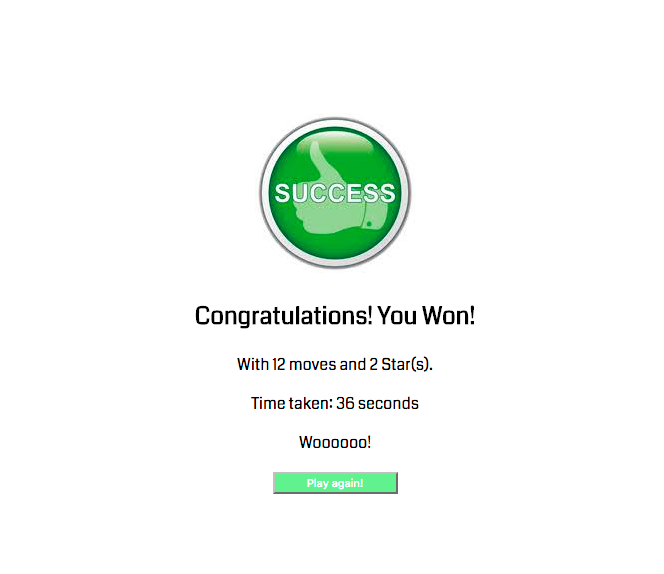

# Memory Game Project

## Table of Contents

* [Installation](#installation)
* [Instructions](#instructions)
* [Contributing](#contributing)
* [Built With](#built)

## Installation

 To load the game, simply download the project and open index.html in the browser.
 Once, you click on one of the cards, the game will begin.

## Instructions

 * The game consists of 16 cards.
 * The user selects two cards.
 * If it is a match, background of the cards turn `green` & the cards stay faced up.
 * If it isn't a match, the background of the cards turn `red` & the cards are turned face down.
 * The user continues to play the game, till all cards are turned facing up.
 * The user can select the refresh button at any point, to restart the game, it is located above the cards.
 * At the end of the game, a `summary` page is shown with the following info: # of moves, star-rating, and how long it took them. Along with a re-play button, as show below.

 

## Built With

* HTML/CSS
* JavaScript

## Contributing
Meena Kamran
